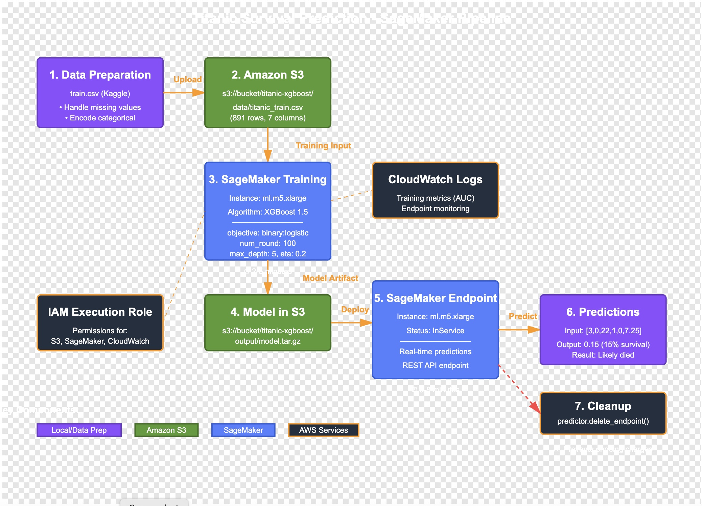

## Week 2 Project: Titanic Prediction with SageMaker XGBoost

### What I Built
- End-to-end ML pipeline on AWS SageMaker
- Used XGBoost built-in algorithm for binary classification
- Deployed real-time prediction endpoint

### Architecture
1. Data preprocessing locally
2. Upload to S3
3. SageMaker training job (ml.m5.xlarge)
4. Model deployment to endpoint
5. Real-time predictions via REST API

### Results
- Training AUC: ~0.85-0.90
- Predictions working correctly
- Successfully deployed and cleaned up resources

### Key Learnings
- SageMaker workflow (data → S3 → train → deploy)
- XGBoost hyperparameter tuning
- Endpoint management and cost control
- Difference between local Jupyter and cloud training

### Architecture

### Pipeline Steps
1. **Data Preparation**: Preprocessed Titanic dataset locally
2. **S3 Upload**: Stored training data in S3 bucket
3. **Training Job**: Used SageMaker XGBoost on ml.m5.xlarge instance
4. **Model Artifact**: Trained model saved to S3 (model.tar.gz)
5. **Endpoint Deployment**: Deployed to ml.m5.xlarge for real-time inference
6. **Predictions**: Successfully tested with sample passengers
7. **Cleanup**: Deleted endpoint to prevent ongoing charges
