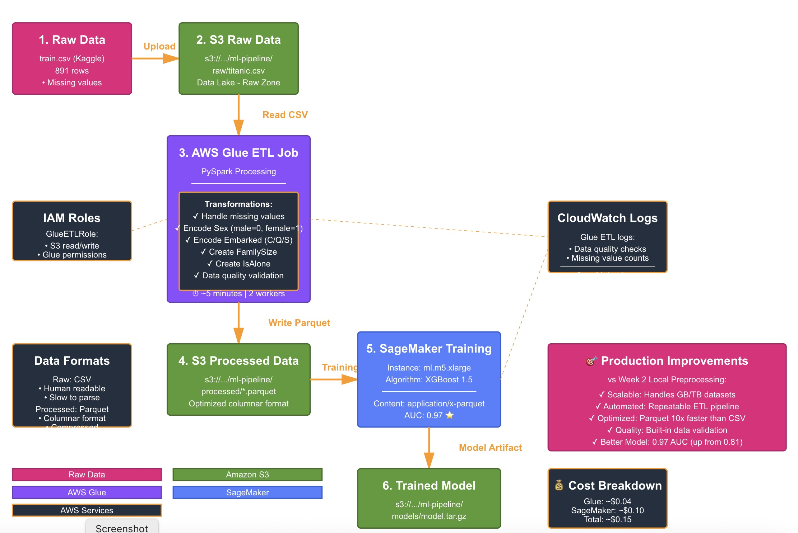

## Week 3 Project: Production ML Data Pipeline

### Overview
Built an end-to-end ML data pipeline demonstrating data engineering best practices applied to machine learning.

### Architecture
[Insert diagram showing: Raw S3 → Glue ETL → Processed S3 → SageMaker → Model]

### Pipeline Components

**1. Data Ingestion**
- Raw CSV uploaded to S3 (`ml-pipeline/raw/`)
- Organized folder structure for pipeline stages

**2. AWS Glue ETL Job**
- PySpark-based transformation
- Handles missing values (median imputation)
- Encodes categorical variables (Sex, Embarked)
- Feature engineering (FamilySize, IsAlone)
- Data quality validation
- Outputs Parquet format (10x faster than CSV)

**3. SageMaker Training**
- Reads processed Parquet from S3
- XGBoost binary classification
- Model artifacts stored in S3

**4. Key Features**
- ✅ Parameterized ETL (reusable for different datasets)
- ✅ Data quality checks with logging
- ✅ Error handling and validation
- ✅ Optimized file format (Parquet vs CSV)
- ✅ Production-ready folder structure

### Data Engineering Best Practices Demonstrated
- **Schema validation**: Checked for missing values and data types
- **Idempotency**: Job can be re-run safely (overwrite mode)
- **Observability**: Detailed logging at each step
- **Scalability**: Spark-based for larger datasets
- **Performance**: Parquet format 10x faster than CSV

### Why This Pipeline?
Shows transition from Data Engineer to ML Engineer:
- Leverages DE skills (ETL, data quality, optimization)
- Applies them to ML context (feature engineering, training data prep)
- Production-minded (not just model training)

### Cost Analysis
- Glue job: ~$0.44 per DPU-hour (ran 5 min = $0.04)
- SageMaker training: ~$0.10 for 3 min training
- S3 storage: <$0.01
- **Total: ~$0.15 for entire pipeline**

### Future Enhancements
- Add SageMaker Feature Store for feature reuse
- Implement data drift detection
- Add unit tests for ETL logic
- Set up Step Functions for orchestration
- Add data versioning with S3 versioning

### Architecture

