# Automated MLOps Pipeline with AWS SageMaker

An end-to-end automated machine learning operations (MLOps) pipeline using AWS services, implementing event-driven training, model registry with approval workflows, and automated deployment.

## Architecture

The pipeline uses event-driven architecture with AWS serverless services to automate the entire ML lifecycle from training to deployment.

```mermaid
graph TB
    subgraph "Data Layer"
        S3_Upload[("📁 S3 Bucket<br/>training-data/")]
        S3_Models[("📦 S3 Bucket<br/>model-artifacts/")]
    end

    subgraph "Event Processing"
        EB1["📡 EventBridge<br/>Object Created"]
        EB2["📡 EventBridge<br/>Training Complete"]
        EB3["📡 EventBridge<br/>Model Approved"]
    end

    subgraph "Lambda Functions"
        L1["⚡ Lambda 1<br/>TriggerTraining"]
        L2["⚡ Lambda 2<br/>RegisterModel"]
        L3["⚡ Lambda 3<br/>DeployModel"]
    end

    subgraph "SageMaker"
        Train["🎓 Training Job<br/>XGBoost"]
        Registry["📚 Model Registry<br/>mlops-pipeline-models"]
        Endpoint["🌐 Production Endpoint<br/>ml.t2.medium"]
    end

    subgraph "Human Interaction"
        User["👤 Data Scientist"]
        Approval["✅ Manual Approval"]
    end

    subgraph "Notifications"
        SNS["📧 SNS Topic<br/>Email Alerts"]
    end

    User -->|Upload CSV| S3_Upload
    S3_Upload -->|Triggers| EB1
    EB1 -->|Invokes| L1
    L1 -->|create_training_job| Train
    Train -->|Model Artifacts| S3_Models
    Train -->|Completed| EB2
    EB2 -->|Invokes| L2
    L2 -->|Register| Registry
    L2 -->|Notify| SNS
    SNS -->|Email| User
    Registry -->|PendingApproval| Approval
    User -->|Approve| Registry
    Registry -->|Approved| EB3
    EB3 -->|Invokes| L3
    L3 -->|Deploy| Endpoint
    L3 -->|Notify| SNS
    Endpoint -->|Predictions| User

    style S3_Upload fill:#FF9900
    style S3_Models fill:#FF9900
    style Train fill:#00A4A6
    style Registry fill:#00A4A6
    style Endpoint fill:#00A4A6
    style L1 fill:#FF9900
    style L2 fill:#FF9900
    style L3 fill:#FF9900
    style SNS fill:#DD344C
    style User fill:#5294CF
    style Approval fill:#5294CF
```


### Pipeline Flow

1. **Data Upload** → User uploads training data to S3
2. **Automated Training** → EventBridge triggers Lambda to start SageMaker training
3. **Model Registration** → Completed model automatically registered in Model Registry
4. **Manual Approval** → Data scientist reviews and approves model
5. **Automated Deployment** → Approved model automatically deployed to endpoint
6. **Production Serving** → Endpoint serves predictions with email notifications at each stage

### Key Components

| Component | Purpose | Technology |
|-----------|---------|------------|
| **Event Triggers** | Orchestrate pipeline | EventBridge (3 rules) |
| **Processing** | Execute pipeline logic | Lambda (3 functions) |
| **Training** | Train ML models | SageMaker Training Jobs |
| **Registry** | Version control & approval | SageMaker Model Registry |
| **Deployment** | Serve predictions | SageMaker Endpoints |
| **Notifications** | Alert on status changes | SNS + Email |
| **Storage** | Data & model artifacts | S3 (2 buckets) |
| **Security** | Access control | IAM Roles |

## Features

- ✅ **Automated Training**: Upload data to S3 triggers training automatically
- ✅ **Model Registry**: Centralized model versioning with approval workflow
- ✅ **Event-Driven**: Serverless orchestration using Lambda + EventBridge
- ✅ **Notifications**: Email alerts at each pipeline stage via SNS
- ✅ **Production Deployment**: Automated endpoint creation for approved models
- ✅ **Security**: IAM roles, S3 encryption, VPC-ready architecture

## Technologies Used

- **AWS SageMaker**: Training jobs, Model Registry, Endpoints
- **AWS Lambda**: Serverless orchestration (3 functions)
- **AWS EventBridge**: Event-driven triggers
- **AWS S3**: Data and model storage
- **AWS SNS**: Email notifications
- **AWS IAM**: Security and access control
- **Python**: boto3, pandas

## Prerequisites

- AWS account with appropriate permissions
- AWS CLI configured (`aws configure`)
- Python 3.11+
- boto3 and pandas installed

## Installation

1. **Clone the repository**
```bash
   git clone <your-repo-url>
   cd mlops-pipeline
```

2. **Install dependencies**
```bash
   pip install -r requirements.txt
```

3. **Configure AWS credentials**
```bash
   aws configure
```

## Usage

### Step 1: Setup Infrastructure
```bash
python3 mlops_setup.py
```

This creates:
- IAM roles (SageMaker execution, Lambda execution)
- S3 buckets (training data, model artifacts)
- SNS topic (notifications)
- Model Package Group (model registry)

**Important**: Confirm your email subscription after this step!

### Step 2: Deploy Lambda Functions
```bash
python3 mlops_lambdas.py
```

Creates 3 Lambda functions:
- `MLOps-TriggerTraining`: Starts training when data arrives
- `MLOps-RegisterModel`: Registers trained models
- `MLOps-DeployModel`: Deploys approved models

### Step 3: Create EventBridge Rules
```bash
python3 mlops_eventbridge.py
```

Sets up event triggers:
- S3 upload → Training
- Training complete → Registration
- Model approved → Deployment

### Step 4: Test the Pipeline
```bash
python3 mlops_test.py
```

This uploads test data and monitors the pipeline. Training takes ~10 minutes.

### Step 5: Approve Model

After training completes (you'll get an email):
```bash
python3 mlops_approve.py
```

Deployment takes ~10 minutes.

### Step 6: Test Endpoint
```bash
python3 test_endpoint_working.py
```

## Pipeline Flow

1. **Upload data** to `s3://mlops-training-{account-id}/training-data/`
2. **Training starts** automatically (8-10 min)
3. **Email notification** when training completes
4. **Model registered** with status `PendingManualApproval`
5. **Approve model** via script or console
6. **Deployment starts** automatically (8-10 min)
7. **Email notification** when endpoint is ready
8. **Send predictions** to endpoint

## Cleanup

To delete all resources and avoid charges:
```bash
python3 cleanup_simple.py
```

**Important**: The endpoint costs ~$1.50/day if left running!

## Project Structure
```
mlops-pipeline/
├── README.md                    # This file
├── mlops_setup.py              # Infrastructure setup
├── mlops_lambdas.py            # Lambda deployment
├── mlops_eventbridge.py        # EventBridge rules
├── mlops_test.py               # Pipeline testing
├── mlops_approve.py            # Model approval
├── test_endpoint_working.py    # Endpoint testing
├── cleanup_simple.py           # Resource cleanup
├── requirements.txt            # Dependencies
└── .gitignore                  # Git ignore rules
```

## Cost Estimate

**Active pipeline (endpoint deployed)**:
- Endpoint (ml.t2.medium): ~$0.065/hour = ~$47/month
- Training (ml.m5.xlarge): ~$0.12/hour (only during training)
- Lambda: Free tier (minimal usage)
- S3: ~$0.01/month
- EventBridge: Free tier
- SNS: Free tier

**After cleanup**: $0/month

## Troubleshooting

### Issue: Training job fails with "Access Denied"
**Solution**: Add S3 permissions to SageMaker execution role
```bash
aws iam attach-role-policy \
    --role-name MLOpsSageMakerRole \
    --policy-arn arn:aws:iam::aws:policy/AmazonS3FullAccess
```

### Issue: Lambda not triggering
**Solution**: Check EventBridge rules are enabled and targets are set correctly

### Issue: Endpoint returns 400 errors
**Solution**: Send features only (no label) as CSV with 7 comma-separated values

## Learning Outcomes

This project demonstrates:
- ✅ Event-driven architecture
- ✅ Serverless orchestration
- ✅ ML model lifecycle management
- ✅ Infrastructure as Code
- ✅ AWS service integration
- ✅ Production ML deployment patterns

## Contributing

This is a learning project for AWS ML Specialty certification. Feel free to fork and modify!

## License

MIT License

## Acknowledgments

Built as part of Week 7 (MLOps & Monitoring) of AWS ML Specialty certification study plan.
